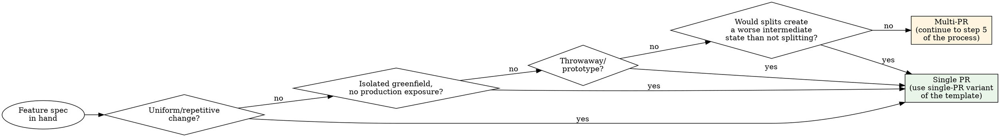

# Decomposing Features into PRs

## Overview

Upfront PR scoping is architectural work. It calibrates risk and review surface, decides what gets the careful eye of a reviewer, and shapes the order in which work meets reality. **The right slice ships value; the wrong slice ships dead code.** A good decomposition produces a small set of PRs that each land safely, deliver something on their own, and survive a future where the next PR never gets built.

Use this skill *before* invoking writing-plans (or Spec Kit `/specify`, or any other implementation tool) so the spec that goes in is already scoped to a single shippable unit.

Announce: "I'm using the decomposing-features-into-prs skill."

## When to Use

Triggers (any of these → use the skill):

- A feature spec spans multiple visible behaviors, multiple subsystems, or a migration plus code change
- Work touches production systems where rollback is expensive
- Sequencing matters (migration before code, contract before consumer, flag before gated path)
- An architectural commitment is being made (canonical model, schema choice, public API surface)
- A cross-cutting refactor touches many files for one reason
- Validation is needed mid-flight — you want PR 1 in production before committing to PR 2
- Multiple reviewers/stakeholders need different parts

**Don't use this skill (single PR is right) when:**

- Uniform/repetitive changes ("add field X to N entities") — splitting creates artificial seams
- Isolated greenfield with no production exposure and clear boundaries
- Throwaway/prototype work you'll iterate destructively on
- The split would create a worse intermediate state than not splitting

## Single PR or Multi-PR?

The default is **single PR**. Multi-PR is what you do when the work refuses to fit. Agents over-decompose far more often than they under-decompose, so the flowchart asks the "don't decompose" questions first.



## The Process

1. **Announce** the skill is in use.
2. **Read the spec.** Identify scope, contracts introduced, systems touched.
3. **Calibrate blast radius.** Use the heuristics in the [Calibration Heuristics](#calibration-heuristics) section. Output: high / medium / low + a one-line rationale.
4. **Decide single-PR vs multi-PR** via the flowchart above. If single PR, jump to step 8.
5. **List candidate vertical slices** — 3 to 7. Each slice is named for the user-visible or operationally-visible behavior it ships, not for the layer it touches.
6. **Apply the 4-question test (below) to each slice.** Discard or merge any slice that fails any question. Re-order so PR N never requires PR N+1 to be useful.
6a. **Map the dependency graph.** For each slice, write down which earlier slice it *hard-depends* on (cannot start without). Slices with no hard dependency on each other can be developed in parallel. Flag the parallel pairs/triples — they're worktree candidates (see [Parallel Development with Worktrees](#parallel-development-with-worktrees)).
7. **Detail PR 1 and PR 2** using the per-PR spec contents below — *if both are definite next steps.* If only PR 1 is definite (PR 2 is conditional — e.g., "only if a second consumer arrives"), detail PR 1 and sketch PR 2 with its conditional trigger; don't fabricate speculative design. **Sketch PRs 3+ as one-line intentions only** (optionally with a rough size S/M/L for capacity planning — no acceptance criteria, no contracts, no per-PR spec). **Exception:** for high-blast-radius features, also detail the irreversible-cutover PR even if it's PR 3+ (e.g., the NOT-NULL constraint after a backfill; the legacy-API removal after dual-write). The reason for sketching is *the architecture you assumed will be wrong*; the reason for detailing is *this step is hard to take back*. When both apply, detailing wins.
8. **Write the decomposition doc** using the template at `decomposition-template.md`. Save to a project-appropriate location (typical: `docs/decompositions/<feature>.md`).
9. **Handoff:** point the user to PR 1's fenced "Spec" block. They paste it verbatim into their implementation tool (e.g., `/specify <paste>`). Do not paraphrase, summarize, or merge with conversation context on the way in. Do not paste the Reviewer notes.

## Vertical Over Horizontal

A good slice ships an observable behavior end-to-end (schema + API + UI + test + flag if needed), scoped to one thing a user or operator can see. A bad slice ships a layer (all schema, then all API, then all UI) — each layer is dead code until the last one lands.

**The trap:** horizontal slices LOOK reasonable. "PR 1: add the table. PR 2: add the API. PR 3: add the UI." Each is small, each is independently mergeable, each has clean review boundaries. But until PR 3 ships, nothing works. If priorities shift after PR 1, you've shipped dead code with a passing test suite.

**Example — OAuth login (Google) alongside existing email/password auth.**

Horizontal (bad), 5 PRs:

1. Provider interface + plugin registry — no concrete provider
2. Google provider implementing the interface — no caller
3. `oauth_providers` table + Google row — no reader
4. `/auth/oauth/:provider/callback` route + linking logic — no UI
5. "Sign in with Google" button + start route

Each PR is "mergeable." None deliver value alone. The interface designed in PR 1 was justified by what reviewers wanted to see in isolation, not by a real second consumer — so when GitHub OAuth lands two quarters later, the interface gets reshaped anyway.

Vertical (good), 1-2 PRs:

1. End-to-end "Sign in with Google" behind a flag: table + Google provider (no interface, just a concrete class) + callback + linking + button + flag. Smaller than the sum of the horizontal split because there's no abstraction layer for hypothetical future providers. Ships value the moment the flag flips.
2. *(Only if a second provider is actually being added)* Extract the provider interface when the second consumer exists.

**Exception:** when a horizontal layer is genuinely the unit of work — e.g., a pure schema expansion as part of an expand–migrate–contract sequence, where the next phase is days or weeks away — own that, call it out, and don't pretend it's vertical. But it's still ONE PR for the whole expansion phase, not a separate PR per table.

### What the vertical PR 1's Spec block looks like

The Spec block (paste into `/specify`) for PR 1 above — note: pure WHAT/WHY in business language, zero schema syntax, zero route patterns, zero library names. Implementation HOW lives in Reviewer notes.

```text
Sign In With Google

## User Story (P1)

A user with a Google account can sign in to the app with one click via a "Sign in with Google" button alongside the existing email/password option. If the user already has an email/password account using the same Google email (verified by Google), the two identities link automatically and they sign in to the existing account. Otherwise a new account is created from the Google profile.

**Why this priority:** This is the entire feature's value. Anything less than end-to-end Google sign-in doesn't ship the feature.

**Independent Test:** A user clicks "Sign in with Google" on the login page, authenticates with Google, and is redirected back to the app signed in to a session indistinguishable from email/password sign-in. Verifiable end-to-end with one Google test account, no other PR required.

**Acceptance Scenarios:**
1. **Given** a user with no existing account, **When** they sign in with Google for the first time, **Then** a new account is created from their Google profile and they are signed in.
2. **Given** a user with an existing email/password account whose email matches a verified Google email, **When** they sign in with Google, **Then** the Google identity is linked to the existing account and they are signed in.
3. **Given** a user who previously linked Google, **When** they sign in with Google again, **Then** they are signed in to the same account.
4. **Given** the feature flag is off, **When** a user visits the login page, **Then** no "Sign in with Google" button is rendered and the Google callback path returns not-found.

## Edge Cases

- What happens when Google returns an unverified email? (Reject linking; do not silently bind to an existing account.)
- What happens if the user closes the Google consent screen mid-flow? (Return to the login page with no partial session created.)
- What happens if the Google identity is already linked to a different internal user? (Reject sign-in with a clear error; do not switch the linkage.)

## Functional Requirements

- **FR-001:** System MUST authenticate users via Google using standard OIDC with the user's email and profile.
- **FR-002:** Users MUST be able to link a Google identity to an existing email/password account when the Google-verified email matches.
- **FR-003:** System MUST create a new user account from the Google profile when no matching email exists.
- **FR-004:** System MUST NOT render the "Sign in with Google" UI or accept Google callbacks when the feature flag is off.
- **FR-005:** Sessions established via Google MUST be indistinguishable downstream from sessions established via email/password (same session shape, same expiry behavior, same downstream authorization).

## Key Entities

- **Identity provider configuration:** A configured external auth source (initially Google), with display name, enablement flag, and a reference to where credentials are stored.
- **External identity link:** Associates an external provider's verified user identifier with an internal user account. Unique per (provider, external user) pair.

## Success Criteria

- **SC-001:** A user can complete the Google sign-in flow end-to-end (click to landed) in under 10 seconds on the happy path.
- **SC-002:** Zero cross-account linkages during rollout — no user is ever signed in as a different user due to OAuth linking logic.
- **SC-003:** When the feature flag is off, zero Google-related UI is rendered and zero callback traffic is accepted (verifiable via metrics).

## Assumptions

- Google OAuth client credentials are provisioned out-of-band in the existing secret store before this PR ships.
- The existing session mechanism is reusable as-is.
- This PR is gated behind a server-side feature flag, off by default; flipping is a separate operational decision.

## Non-Goals

- Adding a second provider (e.g., GitHub) — see PR 2 sketch.
- Account unlinking, multi-identity management UI, or "log in with X" account-recovery flows.
- Changing the existing email/password flow.
- An admin UI for managing the identity-provider configuration (ops-managed for now).
```

What you'd find in Reviewer notes for this PR (not in the Spec block): the `oauth_providers` and `user_oauth_identities` table schemas, the exact callback route pattern, JWKS verification details, dashboard URLs for the SC-### success criteria, deploy ordering (config row seeded before flag flip), rollback (flip the flag), and the 4-question check. None of that should be in the spec — it's all HOW.

## The 4-Question Slice Test

For each candidate slice, answer all four:

1. **Can this PR land without breaking anything?** Yes/no + why.
2. **Does it deliver USER-VISIBLE or OPERATIONAL value alone, even if the next PR never ships?** Yes/no + what value. *"Doesn't break anything" is not value. Tests passing on dead code is not value.* "Operational value" includes things only operators see — an admin tool that works, a dashboard that lights up, a new provisioning capability, a recoverable failure mode that wasn't recoverable before. It does NOT include "this code compiles" or "sets up PR 2." If your answer to Q2 feels strained or generous, the slice is wrong; merge it into the PR that ships the user-visible behavior.
3. **Can a reviewer hold the whole change in their head?** Yes/no + rough file/LoC count.
4. **Are the seams with adjacent PRs clean?** Yes/no + what stays untouched.

If any answer is no, the slice is wrong. Merge it into a neighbor or re-cut it. Question 2 is the one agents misread most often — re-read it before answering.

## Detail PR 1 and 2 — Sketch the Rest

Plan PR 1 and PR 2 fully. Sketch PR 3+ as **named intentions only** (title + one-line intent + optional rough size S/M/L for capacity planning). No Spec block. No acceptance criteria. No phase tables. No sprint allocation.

**Why:** detailed planning of PR 3+ assumes the architecture you assumed for PR 1 was right. You usually find out it wasn't while building PR 1. Detailed forward planning becomes sunk cost that biases you against course-correcting.

**Exception — irreversible cutover steps:** if a later PR is the genuinely irreversible step (PR 3 = setting NOT NULL after a backfill; PR 4 = removing the legacy API after dual-write), detail that PR too. The reason for sketching is *the architecture will be wrong*. The reason for detailing is *this step is hard to take back*. When both pressures apply to a later PR, detailing wins.

**Under pressure to plan further** — PM asks for "the whole plan up front," reviewer asks for "ticket-level detail across the feature," teammate wants Jira tickets for all phases — **show the sketched PR 3+ as named intentions, offer rough S/M/L sizing for capacity, and explain why detail comes later.** Detailed planning of PR 3+ will be wrong, and wrong plans biased against rewriting cost more than rough plans. This is non-negotiable on the *detailed* part; rough sizing for capacity planning is fine. Capitulating to detailed forward planning causes the failure the skill exists to prevent.

## Calibration Heuristics

| Context | Default slicing |
|---|---|
| High blast radius (live customer data, payments, auth, billing) | Bias small. Each PR revertable in isolation. Slice by capability, not by layer. Feature-flag risky behavior. |
| Architectural commitments (canonical model, public API, schema choices hard to reverse) | Each commitment gets its own PR with explicit acceptance criteria. Don't fold commitments into feature PRs. |
| Greenfield / early MVP / no production users | Wider scopes fine. Tighten as real users approach. |
| Internal tooling / one-offs | Single PR usually right. Don't manufacture ceremony. |
| Throwaway / spike / prototype | Single PR. Often no decomposition doc needed unless you're keeping the work. |
| Continuous-deploy team (every merge to main goes to prod, often with progressive rollout) | Stricter "main is always green" discipline. Each PR must be deployable on its own — not just compilable. Feature-flag anything not yet ready for users. Define "shipped" as merged + deployed + observed, not just merged. |
| Release-train / batched-deploy team (cuts go out weekly/biweekly) | PR sequencing within a release matters less (whole batch ships together). Acceptable to fold more into one PR. The re-evaluation cadence is the release, not the merge. |

Project-specific overrides (which systems are "high blast radius" for *this* codebase, which deploy cadence applies) belong in the project's `CLAUDE.md`, not here.

## Per-PR Spec Contents

The per-PR detail is split into two blocks. The **Spec block** is the paste-ready payload for Spec Kit's `/specify` (or any spec-driven tool); it describes WHAT and WHY in business language. The **Reviewer notes** hold operational HOW and slice-correctness checks for human review.

### In the Spec block (paste into `/specify`) — WHAT/WHY only

Aligned with Spec Kit's `spec-template.md` structure so `/specify` produces high-quality output on first pass:

- **Feature name** — 2-4 words, action-noun format, technical terms preserved
- **User Story (P1)** — plain-language description of the primary user journey, with:
  - **Why this priority** — the user value this PR delivers
  - **Independent Test** — the specific action that proves it works, even if no other PR ships
  - **Acceptance Scenarios** — in `Given <state>, When <action>, Then <outcome>` format
- **User Story (P2)** *(optional)* — only if this PR ships a secondary user-visible behavior; same structure as P1
- **Edge Cases** — boundary conditions, error scenarios, dependency-failure modes
- **Functional Requirements** — numbered `FR-001: System MUST...` statements in business terms. Mark unknowns inline: `[NEEDS CLARIFICATION: <question>]`
- **Key Entities** — what data represents, attributes, relationships — *no column types, no schema syntax*. This discipline is genuinely uncomfortable on transactional/data-heavy systems where the line between "what it represents" and "what its shape is" feels fuzzy. Hold the line anyway — types are HOW. The concrete schema lives in Reviewer notes; Key Entities is the conceptual model.
- **Success Criteria** — numbered `SC-001:` measurable, technology-agnostic outcomes (user-facing AND operational, e.g. "operations team sees delivery rate within X seconds")
- **Assumptions** — explicit defaults inferred for things not specified
- **Non-Goals** — what this PR explicitly does NOT do

### In the Reviewer notes (do NOT paste into `/specify`) — HOW only

Operational detail Spec Kit's `/specify` doesn't want, but reviewers need to validate the slice:

- **4-question check** — Q1 lands, Q2 delivers value alone, Q3 reviewable, Q4 clean seams
- **Data and interface contracts (implementation)** — schema diffs, API signatures, event payload shapes, exact syntax
- **Observability implementation** — dashboard URLs, metric names, alert configs, log queries (the HOW that satisfies the SC-### Success Criteria)
- **Deploy / migrate ordering** *(when sequencing matters)* — what must deploy first, what gates the next ramp step
- **Rollback plan** — feature flag? schema-compatible revert? trigger metric? owner?
- **Dependencies (PRs / external systems)** — what must already be merged
- **Test approach (implementation)** — unit/integration/E2E layers, fixtures

Sketched PRs get only: title + one-line intent + optional S/M/L sizing. No Spec block.

## The Decomposition Doc

The artifact this skill produces. Default location: `docs/decompositions/<feature-name>.md` (override per project convention). It captures:

- The decomposition decision (single PR or multi, with rationale)
- Cross-cutting contracts that span PRs (canonical reference for the human reviewing the doc) — includes application-layer contracts (schemas, API signatures, event payloads) AND infrastructure contracts (IAM permissions, network policies, secret refs, resource shapes, K8s manifests, Terraform module changes). For multi-PR features that touch production infrastructure, IaC commitments are equally load-bearing as API commitments — treat them with the same gravity.
- PR 1 and PR 2 full spec (or PR 1 only, plus any later irreversible-cutover PR detailed)
- PR 3+ as named intentions
- A PR tracking table (URLs, branches, status) — see "GitHub Process" section
- A re-evaluation section appended after each PR ships

**Important: the Spec block for each PR must be SELF-CONTAINED.** The implementation tool (`/specify`, writing-plans, etc.) reads only the Spec block — it cannot follow references to the Cross-Cutting Contracts section or elsewhere in the doc. If your Spec block says "see the Cross-Cutting Contracts section above," fix it: reproduce the relevant contract subset inline. The Cross-Cutting Contracts section exists for the human reviewer to see the contracts in one place; the per-PR Spec blocks are independent paste-payloads that happen to reproduce overlapping content. Tolerate the duplication.

**Each detailed PR section contains TWO blocks:**

1. A fenced "Spec (paste into `/specify`)" block — pure natural-language spec, ready to copy-paste into your implementation tool verbatim.
2. A "Reviewer notes" section — the 4-question check, rollback plan, etc. Lives in the doc for the human reviewing the decomposition; **does NOT go into the implementation tool's prompt.**

Use the template at `decomposition-template.md`. Both multi-PR and single-PR variants are in there.

## Handoff to Implementation

Once the decomposition doc is written:

1. Point the user to PR 1's fenced **Spec** block.
2. They copy it as-is and paste into their implementation tool: `/specify <paste>` (Spec Kit), or hand to writing-plans, or whatever planning tool they use.
3. **Strict zero-edit rule.** Do not paraphrase, summarize, reformat, or merge with conversation context on the way in. If something's missing or wrong, fix it in the decomposition doc and re-emit — never patch on the way to the tool.
4. **Do not paste the Reviewer notes block.** Those are for human review of the decomposition, not for the implementation tool's prompt.

The reason for strict zero-edit: rewriting the spec on the way into the tool degrades signal and creates two sources of truth. The decomposition doc IS the spec. The implementation tool reads the spec.

## GitHub Process

The decomposition doc plans the PRs; this section is how the PRs get tracked once they exist. Conventions below are defaults — override per project, but adopt *something* equivalent. Without a process, the link between the decomposition doc and the actual PRs decays after PR 1 ships.

**PR title convention:** `[<feature-slug>] PR N/M: <title>`

- Example: `[oauth-google] PR 1/2: End-to-end Sign in with Google behind flag`
- `M` reflects the *current* plan (sketched PRs count). When the plan changes after re-evaluation, the denominators update.

**Branch naming:** `<feature-slug>/pr-N-<slug>`

- Example: `oauth-google/pr-1-end-to-end-google-flag`
- Branches group visually in `git branch --list` and in GitHub's branch picker.

**PR description template:** every PR opened against a decomposition doc must include:

```markdown
**Decomposition:** [<feature-slug>](../docs/decompositions/<feature-slug>.md) — PR N/M

**Spec for this PR:** [link to PR N section in the decomposition doc, anchored]

<the fenced Spec block, copy-pasted from the decomposition doc — same content the implementation tool received>

**Reviewer notes:** see [decomposition doc → PR N → Reviewer notes](anchor) for the 4-question check, rollback plan, and deploy ordering.
```

The PR description quotes the Spec block so reviewers don't need to context-switch. The link to Reviewer notes covers everything that didn't paste-verbatim.

**Status tracking in the decomposition doc:** the doc's `## PR Sequence Overview` table gains a `Status` column. Lifecycle:

| Status | Trigger |
|---|---|
| `planned` | PR exists in the doc but no branch / PR opened |
| `in-review` | PR opened in GitHub (link added to table) |
| `merged` | PR merged to main |
| `shipped` | merged + deployed + observed without regression (the actual "shipped" — see Calibration Heuristics) |

The `shipped` transition unblocks the re-evaluation of PR 2+. Updating *only* to `merged` and then starting PR 2 is the failure mode called out in Failure Modes — don't.

**Updating the doc:** after each status change, edit the PR Sequence Overview row. After the `shipped` transition, append to the Re-evaluation Notes section (what was learned, what changed about the plan for PR 2+, any sketched PRs to detail or drop). This is non-negotiable for multi-PR features; without it, the doc drifts and PR 2 plans against a stale picture of PR 1.

## Parallel Development with Worktrees

The dependency graph from process step 6a tells you which PRs *don't* depend on each other. Mutually-independent PRs are candidates for parallel development via git worktrees (one branch checked out per directory, simultaneously).

**When parallel worktrees win:**

- Two PRs touch disjoint file sets (e.g., backend API PR vs. independent frontend page PR).
- Two PRs both branch from main with no inter-dependency.
- You're solo and want to context-switch cheaply, or you're handing off PR 2 to a teammate while you continue PR 1.

**When they don't (and you should not parallelize):**

- The PRs share file overlap large enough that one's merge will block the other on conflicts. Rule of thumb: if you'd expect >10 lines of conflict resolution, the saved wall-clock time is gone.
- PR N+1 depends on PR N's contract being settled. Building PR N+1 against a contract still being shaped means rewriting PR N+1 when PR N's review feedback lands.
- The work is genuinely sequential — "detail PR 1, ship, learn, then plan PR 2" precludes parallelism for the planning step even when the code wouldn't conflict.
- A single reviewer constituency owns both — parallel PRs just create review queue contention.

**How to flag in the decomposition doc:**

The PR Sequence Overview table has a `Depends on (hard)` column. After ordering, add a `## Parallel Work Opportunities` subsection listing pairs/triples with no mutual dependency, including:

- The pair (e.g., "PR 2 ‖ PR 3 — disjoint file sets, both branch from main")
- The file-overlap risk assessment (low / medium / high)
- The worktree setup command, if recommended

**Worktree mechanics:** for the actual setup (creating worktrees, branch naming, cleanup), defer to the `superpowers:using-git-worktrees` skill. This skill identifies *where* worktrees help; that skill executes them.

**Anti-pattern:** parallelizing PR 1 and PR 2 *before* PR 1 has been validated in production. The whole "detail 1-2, ship, re-evaluate" cycle depends on shipping PR 1 first; doing them in parallel guts the learning loop. Worktree parallelism is for PRs where neither is the next learning checkpoint (e.g., PR 2 and PR 3 after PR 1 ships, or two pre-planned independent slices in the same release).

## Failure Modes

Each row pairs an **Excuse** (what you might think) with a **Reality** that includes both a **Tell** (how to recognize you're rationalizing) and a **Counter** (what to do instead). Use the Tells in-flight — they're what catches the rationalization in the moment instead of after the decomposition has set.

Grouped by trigger type so you can jump to the relevant category under pressure.

### Social pressure (authority / process expectations push the wrong way)

| Excuse | Reality |
|---|---|
| "PM wants the whole plan up front" | **Tell:** you're about to write acceptance criteria for PR 5. **Counter:** show sketched PR 3+ as named intentions with rough S/M/L sizing for capacity, and explain that detailed planning of PR 3+ is sunk cost — it will change once PR 1 ships. Detailed-everything plans please the PM in the moment but cost more when they're discarded. |
| "PRs over N lines don't get proper review" → split to hit a line ceiling | **Tell:** you're slicing by line count instead of by behavior, and the seam between PR 1 and PR 2 cuts mid-feature. **Counter:** the shippable unit is the unit, not a line count. Reviewer fatigue is real, but the answer is structure/tests/walkthrough — not artificial cuts that produce vanity slices. If the real shippable unit is genuinely too large to review, ask "what structure or test framing would make this reviewable," not "where do I cut it." |
| "Phase the work into sprints up front so the PM can size it" | **Tell:** you've drawn a sprint-by-sprint allocation before deciding what's in PR 1. **Counter:** sprint allocation past PR 1-2 is sunk-cost planning. Estimate PR 1 + offer rough S/M/L for PRs 3+; re-estimate after PR 1 ships. |
| "The reviewer asked me to split this further" | **Tell:** you're re-cutting a slice that already passed the 4-question test because a senior person pushed back, and your new sub-slices won't pass Q2. **Counter:** the test applies regardless of who's asking. Splitting a Q2-passing slice into two Q2-failing slices is wrong. Push back diplomatically with the test results — reviewers can be wrong about decomposition. (If they cite policy/compliance, defer — see the compliance row.) |

### Technical seduction (designs that look clean but cost)

| Excuse | Reality |
|---|---|
| "This PR forces the abstraction question on its own" / "isolated review of the interface" | **Tell:** PR 1 is an interface/registry/plugin system, PR 2 is the first concrete consumer. **Counter:** speculative abstraction. The abstraction is justified by a real second consumer, not by review aesthetics. Ship the first consumer's full vertical slice; generalize only when the second consumer exists. |
| "Add the column / abstraction now to avoid a future migration" | **Tell:** you're adding a field, table, or interface that no consumer in the current PR uses. **Counter:** speculative design. YAGNI. Add it when the consumer exists. The migration "saved" is hypothetical; the dead code is real. |
| "Each PR is independently mergeable" (read as "doesn't break anything") | **Tell:** your Q2 answer for some PR is "doesn't break anything" or "tests pass." **Counter:** mergeable ≠ shippable. Q2 asks *delivers value alone*, not *fails to break things*. Dead code with passing tests is still dead code. |
| "It's just a refactor — no behavior change, Q2 doesn't really apply" | **Tell:** the PR description starts with "Cleanup," "Refactor only," or "No-op restructuring" and you're about to skip the 4-question test. **Counter:** refactor PRs are still PRs and still need to pass Q2. "Cleaner code" is developer value, not user-visible or operational value — it doesn't satisfy Q2. Bundle the refactor with the next behavior change that justifies it, OR justify it with a concrete operational reason (specific perf number, security CVE, documented maintainability blocker for upcoming work). "It's tidier" is not enough. |
| "PR 1 is huge but it's all just infrastructure" | **Tell:** PR 1 has a long file list and no user-visible behavior — but "it's mostly setup, so it's fine." **Counter:** code volume isn't the failure mode; *consumer-less infrastructure* is. A big PR with infrastructure + first consumer + tests is fine and reviewable with a walkthrough. A "small" PR with infrastructure and no consumer fails Q2 regardless of size. The question isn't "how much code," it's "does any of this code serve a user or operator the moment the PR merges." |

### Sequencing / timing errors (right idea, wrong place in time)

| Excuse | Reality |
|---|---|
| "Telemetry / observability / runbook deserves its own PR" | **Tell:** you have a PR titled "Add metrics for X" or "Dashboards for Y" with no behavior change. **Counter:** almost never. Observability ships with the behavior it observes. A dashboard PR alone is ceremony. Observability is a field of the Per-PR Spec for high-blast PRs — it rides with the feature. |
| "Rollout config flip is its own PR" | **Tell:** you have three PRs labeled "Enable for 10%," "Enable for 50%," "Enable for 100%." **Counter:** for additive low-blast changes, almost never — the flip ships with the code. For high-blast progressive rollouts (canary → 10% → 50% → 100% over hours/days), the ramp protocol IS its own PR — with explicit gating criteria, observability dashboard links, and rollback triggers — because the ramp is the operationally risky thing. ONE ramp PR per high-blast feature, NOT one PR per ramp step. |
| "Splitting expand–migrate–contract into one PR per step is the safe way" | **Tell:** you have separate PRs for "add nullable column," "backfill," and "create index" on the same set of tables. **Counter:** one PR per *phase*, not per step. The whole expansion (add column nullable + index + backfill, all 20 tables) is ONE PR. The contraction (set NOT NULL) is the next PR. Splitting further is horizontal slicing dressed as safety. |
| "PR 1 is done, I'll start PR 2 now" (after merge but before deploy) | **Tell:** you're opening PR 2's branch the same day PR 1 merged, before deploy + soak. **Counter:** "shipped" means merged + deployed + observed without regression — not just merged. Starting PR 2 before PR 1 is observed loses the entire ship-and-re-evaluate cycle. Continuous-deploy teams: wait for the post-deploy soak. Release-train teams: wait for the release to cut. |
| "Let me add the tests in their own PR" | **Tell:** PR 1 has the behavior, PR 2 is titled "Add tests for [PR 1 feature]." **Counter:** tests ride with the behavior they test. A "tests PR" defeats the test-with-implementation discipline and lets PR 1 merge unverified. Acceptance criteria are verified at PR 1's merge time, not later. If you're tempted to defer tests because they're slow to write, the answer is to invest in test framing, not to defer verification. |
| "This PR is risky, let me split it into smaller PRs to reduce risk" | **Tell:** you're decomposing one risky change into multiple PRs that each carry a portion of the same risk, without changing what's risky about it. **Counter:** risk doesn't divide along PR boundaries. Smaller PRs of the same risky change is slower delivery of the same risk, not less of it. Reduce risk by (a) feature-flagging the risky behavior, (b) using expand-migrate-contract to make the risky step revertable, or (c) carving the truly irreversible step into its own detailed PR — NOT by chopping the same change into thirds. |

### Risk / compliance miscalibration

| Excuse | Reality |
|---|---|
| "Auth-critical / production-critical so small PRs are justified" | **Tell:** you're slicing aggressively because the topic feels scary, even though the changes are additive and behind a flag. **Counter:** true for irreversible changes (schema migrations, hard cutover, public API removal). NOT true for additive validation, new behavior behind a flag, or anything revertable. Calibrate by what's actually irreversible, not by topic. Auth code that adds a new flag-gated method gets the same calibration as any flag-gated method. |
| "It's additive validation so the auth-critical rule doesn't apply" — but the team has SOC2 / PCI / HIPAA gating | **Tell:** you're applying the "additive doesn't need small PRs" rule in an environment with mandatory security review for any auth-code touch. **Counter:** compliance change-management overrides the technical calibration. If every auth change requires security review regardless of additivity, the security-review gate becomes the slicing constraint — slice to fit what the gate can review, not what the code permits. The "additive doesn't justify small PRs" rule assumes a free change-management environment; when it doesn't, the rule inverts. |

### Spec degradation

| Excuse | Reality |
|---|---|
| "I'll lightly reformat the spec on the way into the implementation tool" | **Tell:** you're about to paste the Spec block into `/specify` with edits, paraphrasing, or context merges. **Counter:** no. Strict zero-edit. If it needs reformatting, fix it in the decomposition doc and re-emit. Two sources of truth = two sources of bugs. |
| "I'll include schema / API / code details in the Spec block so /specify has enough context" | **Tell:** your Spec block has `CREATE TABLE` syntax, type annotations, function signatures, route patterns, or library names. **Counter:** Spec Kit's `/specify` expects WHAT/WHY in business language and produces structured requirements as output — pre-cooking it with implementation HOW leaks tech decisions into the spec, biases the plan toward your assumptions, and makes the spec stale the moment any of those details changes. Keep schema diffs, API signatures, code patterns, and library names in **Reviewer notes** / **Cross-Cutting Contracts**. The Spec block describes Key Entities (what data represents, attributes, relationships — no syntax) and Functional Requirements (MUST statements in business terms). |

### Meta-rationalization (post-test fatigue and gaming)

| Excuse | Reality |
|---|---|
| "PR 2 'delivers value alone' but I had to stretch to find it" | **Tell:** your Q2 answer reads "well, an operator could technically..." or "it enables future..." **Counter:** if Q2 felt strained or generous, you're rationalizing. Genuine operational value means an operator gains a new capability, not "this enables PR 3." When the honest answer is "it sets up the next PR," merge it into the PR that ships the user-visible behavior. |
| "I'll detail PR 3 just enough to know I'm not missing anything" | **Tell:** you've written acceptance criteria, contracts, or test approach for PR 3 — even briefly. Or your PR 3 entry has grown past one line. **Counter:** "just enough" is the negotiation backdoor to detailed forward planning. Sketch means: title + one-line intent + optional S/M/L sizing. No acceptance criteria. No contracts. No "tentative spec." If you genuinely don't know whether PR 3 is real, that's a signal to validate PR 1 first, not to over-plan PR 3. |
| "Sub-splitting this slice fixes the 'reviewer can hold it in head' question" | **Tell:** a slice failed Q3 (too big for review) and you're about to halve it into two slices that each fail Q2 (neither delivers value alone). **Counter:** a slice that fails Q2 doesn't get fixed by being split further — both halves still fail Q2. The fix for Q3 is structural (better tests, walkthrough, helper extraction inside the same PR) or it's a sign the slice is genuinely the wrong shape and needs re-cutting from scratch, not subdividing. |
| "I've been at this 30 minutes — this is the best slicing I can do" | **Tell:** you've stopped re-checking the 4-question test because you're tired and your current plan "feels OK." **Counter:** fatigue capitulation. Decomposition decisions are extremely high-leverage — 15 more minutes of thought is cheap compared to a wrong-shaped 3-PR plan that costs days of rework. If you genuinely can't see the right shape, the failure isn't the decomposition, it's the spec — go back to scoping/brainstorming before continuing. |

## Red Flags — STOP

If any of these are true, stop and re-decompose:

- The plan has 5+ PRs and you wrote detailed specs for all of them
- PR 1 adds infrastructure (interface, table, middleware) with no consumer in the same PR
- Two adjacent PRs would HAVE to land within the same week to be useful → they're one PR
- "Observability," "telemetry," "runbook," "rollout," or "hardening" appears as its own PR title
- The decomposition was driven by a line-count rule rather than a slice judgment
- A phase/sprint breakdown showed up before the slice judgment
- You're about to paste a spec into the implementation tool with edits "to clean it up"
- You wrote a decomposition doc 200+ lines long for a 1-paragraph ticket
- The single-PR doc you wrote is >50 lines (you're recreating ceremony you ruled out)

All of these mean: re-cut the slices using the 4-question test, ruthlessly merge or drop scaffolding-only PRs, and trim detailed planning past PR 2.

## Quick Reference

**Decompose into multiple PRs when:** production blast radius, sequencing risk, architectural commitment, cross-cutting refactor, validation needed mid-flight, multiple reviewer constituencies.

**Single PR when:** uniform/repetitive changes, isolated greenfield, throwaway, splits create worse intermediate states.

**4-question test (every slice must pass all 4):**

1. Lands without breaking?
2. Delivers user-visible or operational value alone?
3. Reviewer holds it in head?
4. Clean seams?

**Detail PR 1 + PR 2. Sketch the rest as named intentions only.** No Spec block, no acceptance criteria, no phase tables, no sprint allocation for PR 3+.

**Per-PR Spec block includes:** goal, non-goals, acceptance criteria, contracts, dependencies, test approach. (Rollback goes in Reviewer notes.)

**Handoff:** paste PR 1's fenced Spec block into your implementation tool verbatim. Never the Reviewer notes. No edits.
