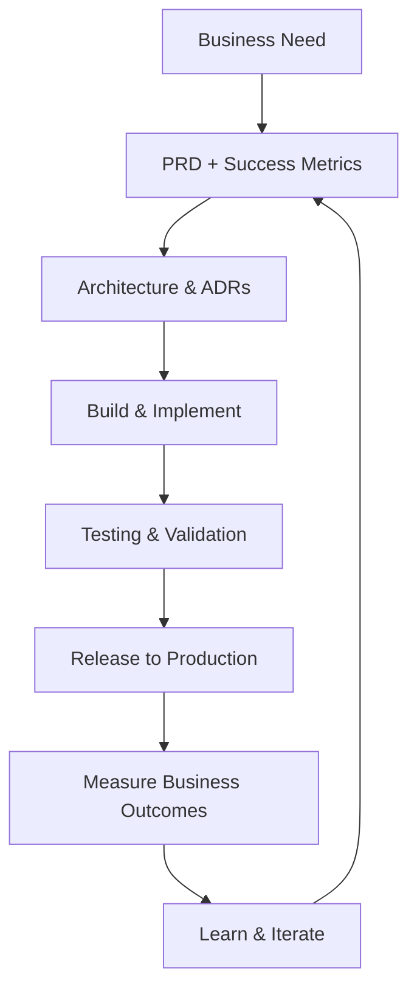
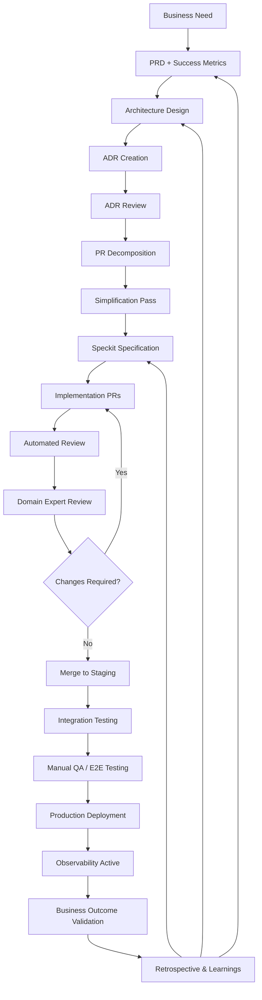

# AI-Native Software Delivery Value Stream

This document describes the end-to-end engineering value stream, split into:
- Executive view (high-level flow)
- Engineering execution view (detailed operational lifecycle)

---

# 1. Executive View (High-Level)

This view is intended for product, leadership, and cross-functional alignment.

---

# 2. Engineering Execution View (Detailed System)

This is the operational model used during development and delivery.

---

# 3. Key Principles

## 3.1 Every phase produces an artifact
- PRD
- ADRs
- Speckit
- PRs
- Tests
- Metrics
- Observability dashboards

---

## 3.2 Every phase has a quality gate
Work cannot proceed without:
- Clear inputs
- Defined outputs
- Explicit review criteria

---

## 3.3 Feedback is mandatory
Production outcomes feed directly back into:
- Product discovery
- Architecture decisions
- Implementation specifications

---

## 3.4 Separation of concerns
- PRD = what + why
- ADR = how (system-level)
- Speckit = how (implementation-level)
- PR = execution

---

# 4. Optional Extension (Operational Layering)

If running locally, the implementation phase assumes:

- Frontend server
- API server
- Database
- Worker processes
- Queue/pubsub
- Observability stack

(Recommended to map these to fixed ports in local dev environments)
